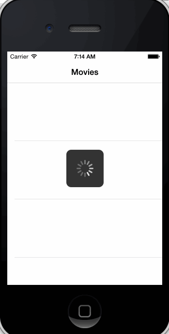
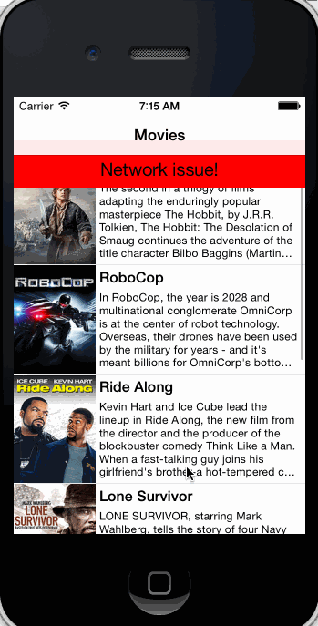
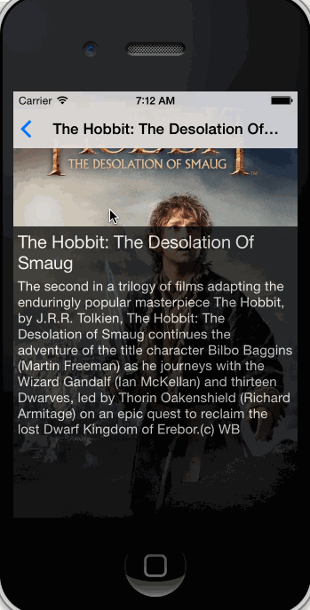

# RottenTomatoes Box Office Demo for CodePath class

This is an sample app built on top of the [RottenTomatoes API](http://www.rottentomatoes.com) as part of the CodePath iOS training class.

Time spent: ~8 hours spent in total

Completed user stories:

 * [x] Required: User can view a list of movies from Rotten Tomatoes.  Poster images must be loading asynchronously.
 * [x] Required: User can view movie details by tapping on a cell.
 * [x] Required: User sees loading state while waiting for movies API.
 * [x] Required: User sees error message when there's a networking error.  You may not use UIAlertView to display the error.
 * [x] Required: User can pull to refresh the movie list.
 * [x] Optional: For the large poster, load the low-res image first, switch to high-res when complete.
 * [x] Optional: All images should be cached in memory and disk. In other words, images load immediately upon cold start. 

Walkthrough of all user stories:

